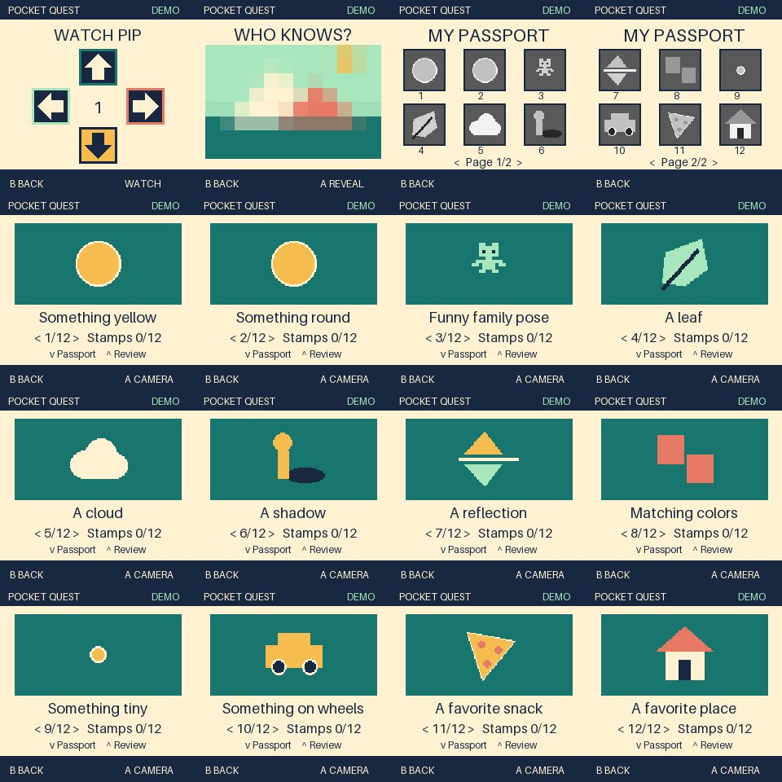

# Software handoff and hardware boundary

## Implemented software scope

Camera (Mac webcam/file/fixture; lazy Pi adapter), local filters, original/result
album, approved Gemini/OpenAI jobs, queue recovery/caps, photo export, three offline
games, twelve illustrated missions, outing selection, two-page stamp passport,
saved evidence review, local grown-up controls and an opt-in paired companion.

Copy Pip demonstrates one to five directions with 600 ms flashes/250 ms gaps,
ignores demonstration inputs, retries the same sequence gently, and replays saved
sequences on return. Held keys cannot supply repeated guesses. Losing window focus
pauses it; returning replays the demonstration. Photo Guess has five reveal levels,
uses originals, persists its current image/level, skips missing/corrupt images and
uses bundled pictures if no eligible originals remain. Neither game needs a camera,
network, audio, or API key.

Capture retains a configurable free-space reserve (200 MiB default plus estimated
image-write room; `--storage-reserve-mib`, minimum 16). Failure leaves originals
untouched and asks for export. No automatic photo deletion is implemented.

Existing three mission IDs retain their meaning. Old saves lacking new game fields
still load. Parent preferences live separately in `preferences.json`; unreadable
preferences pause magic and exclude existing photos from games until parent review.

## Run and verify later

```sh
cd /Users/yuvalbau/dev_cursor/pocket-quest
bash software/scripts/run_quest.sh
# Repeatable automated checks; companion tests bind ephemeral localhost ports:
bash software/scripts/check_quest.sh
```

Home → Play → left/right chooses the game. Home → Explore → Down opens the passport;
Up reviews saved mission evidence. Home → Up opens the grown-up menu. Export from that
menu writes to `Pocket Quest Exports` beside the data directory (normally in your home
folder). The CLI accepts any new destination outside the library. A photo ZIP is not
a full app-state restore; retain the data directory separately if migrating devices.

Hands-on testing is deliberately deferred at the user's request. Follow TESTING.md
when ready. Automated tests and browser checks already run during implementation.



## Hardware facts and blockers

| Part | Known | Still required |
| --- | --- | --- |
| Raspberry Pi | User says Pi Zero | Exact Zero / Zero W / Zero 2 W model, architecture and OS |
| Camera | User says Pi camera | Sensor/model, correct cable, working camera enumeration |
| Display/game module | 1.54-inch 240×240, AliExpress listing supplied | Manufacturer, controller, SPI mode, pinout and button wiring |
| Power | Not confirmed | Power board, battery capacity, safe shutdown path |

On the actual Pi, run the read-only identification script:

```sh
bash software/scripts/hardware_report.sh
```

It reports model/OS/architecture, available Python hardware modules and camera
enumeration when camera tools are installed. It does not write GPIO, scan I²C buses,
install services, change radios, or reveal the board serial number. It cannot infer
the display wiring. Obtain the module's manufacturer pinout before implementing an
adapter; never reuse upstream 320×240 wiring blindly.

Remaining work requires physical evidence/access: LCD/input adapter, verified Pi
camera operation, board-appropriate dependency installation, startup/shutdown service,
radio controls if supported, measured preview/input performance, temperature, battery
runtime, physical QR/hotspot checks, child usability trial and the release soak.
No hardware-ready claim or battery estimate is made. English is implemented; other
languages are not selected or implemented. OpenAI live testing is separate from the
already-observed Gemini success and must be explicitly parent-approved.
